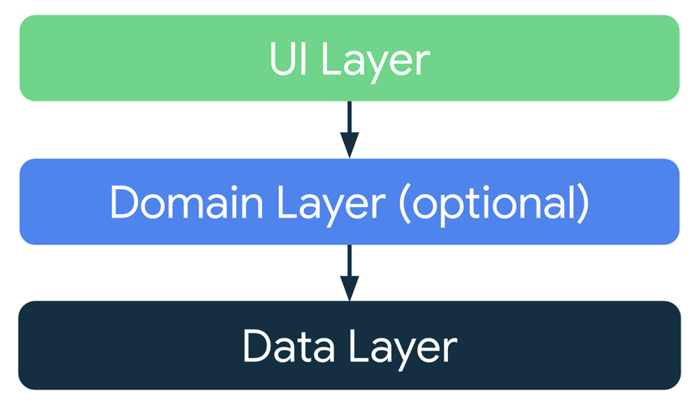
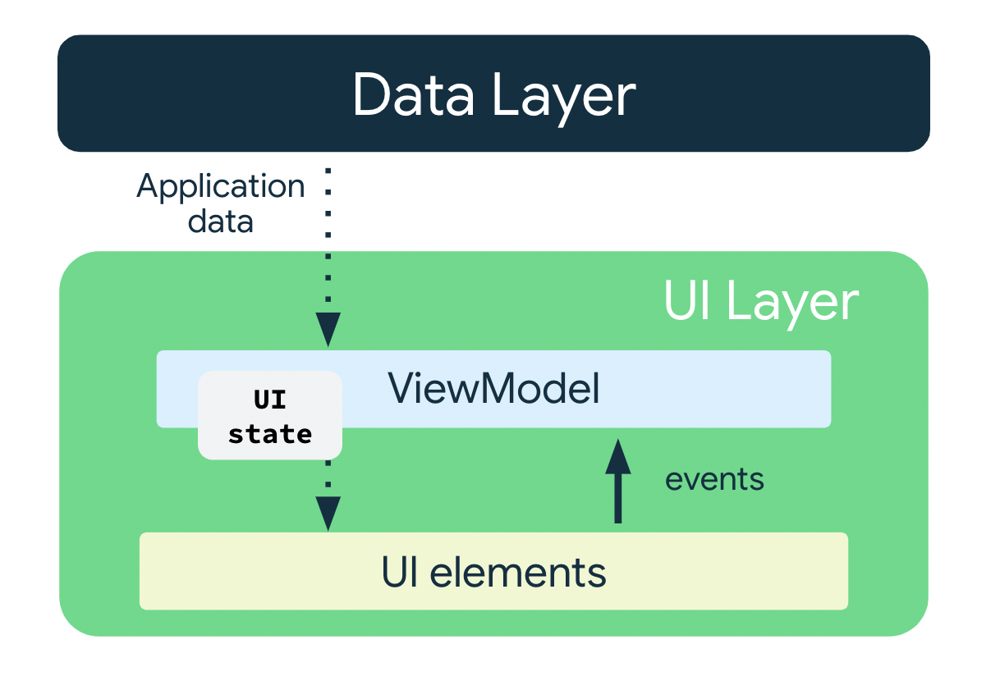
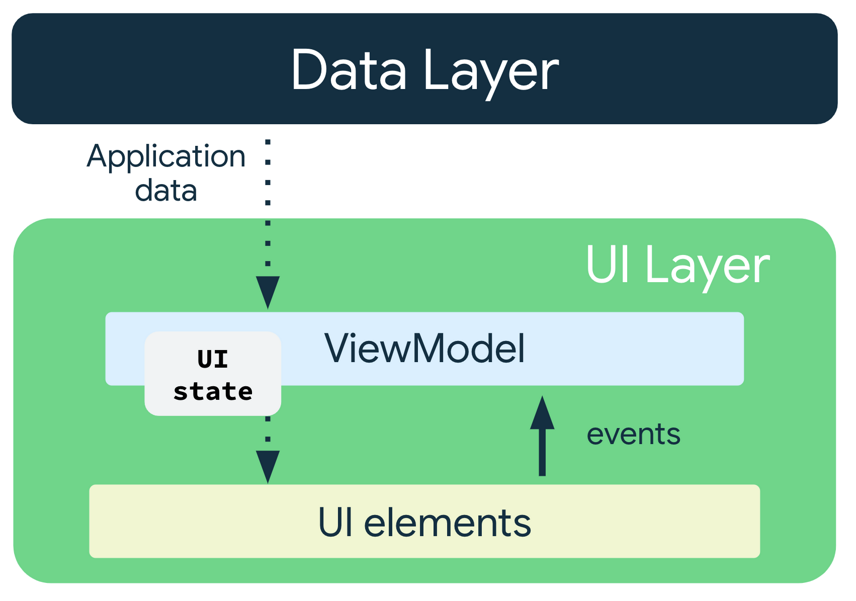

Ao desenvolver aplicativos Android, lidamos constantemente com o **ciclo de vida** e o **estado** da nossa aplicação. Como vimos, uma simples rotação de tela pode destruir uma `Activity` e, com ela, todo o estado local que você gerencia com `remember { mutableStateOf(...) }`.

A solução para esse problema é o **ViewModel**, um componente fundamental da arquitetura moderna do Android que atua como um guardião do seu estado, garantindo que ele sobreviva às mudanças de configuração e mantenha sua interface consistente.

---

### O que é um ViewModel?

O `ViewModel` é uma classe que armazena e gerencia dados relacionados à interface do usuário. Ele foi projetado para ser **Lifecycle Aware**, ou seja, ele "entende" o ciclo de vida da `Activity` ou do `Fragment` ao qual está vinculado.

**Por que usar ViewModel?**

- **Sobrevive a mudanças de configuração:** O `ViewModel` permanece na memória mesmo quando a tela é recriada. Isso significa que, se o usuário rotacionar o celular, todos os dados e a lógica da UI que você armazena no `ViewModel` não serão perdidos.
- **Separação de responsabilidades:** Ele isola a **lógica de negócios** (como cálculos e requisições de dados) da **UI**. A sua tela `@Composable` se torna "burra", responsável apenas por exibir o estado e enviar eventos, enquanto o `ViewModel` cuida do processamento.
- **Gerenciamento de dados:** É a solução ideal para gerenciar o **estado da tela**. Ele atua como uma camada intermediária, conectando a UI com a sua fonte de dados.

---

### Arquitetura de App Recomendada

Para construir apps robustos e escaláveis, é crucial seguir uma arquitetura bem definida. Considerando os princípios de arquitetura comuns, cada aplicativo precisa ter pelo menos duas camadas:

- **Camada de interface (UI):** Responsável por exibir os dados do app na tela. Esta camada é completamente independente dos dados; ela apenas sabe como mostrar o que o `ViewModel` fornece.
- **Camada de dados:** Responsável por armazenar, recuperar e expor os dados do app, seja de uma API, um banco de dados local ou do disco.

O **ViewModel** atua como a ponte entre essas duas camadas, recebendo eventos da **camada de interface** e orquestrando as operações na **camada de dados** para atualizar o estado da UI.

É possível adicionar uma camada extra, conhecida como **camada de domínios**, para simplificar e reutilizar as interações entre a interface e as camadas de dados.



### Camada de Interface

A função da **camada de interface**, ou camada de apresentação, é exibir os dados do aplicativo na tela. Sempre que os dados mudam devido a uma interação do usuário, como o pressionamento de um botão, a interface precisa ser atualizada para refletir as mudanças.

A camada de interface é composta pelos seguintes componentes:

- **Elementos da interface:** Componentes que renderizam os dados na tela. Em nosso caso iremos criar esses elementos usando o **Jetpack Compose**.
- **Detentores de estado:** Componentes que armazenam os dados, os expõem à interface e processam a lógica do app. Um exemplo de detentor de estado é o **ViewModel**.



#### ViewModel

O componente **ViewModel** armazena e expõe o estado que a interface consome. O estado da interface são os dados do aplicativo transformados pelo `ViewModel`. O `ViewModel` permite que o app siga o princípio de arquitetura para orientar a interface do modelo.

O `ViewModel` armazena os dados relacionados ao app que não são destruídos quando a atividade é destruída e recriada pelo framework do Android. Ao contrário da instância de atividade, os objetos `ViewModel` não são destruídos. O app retém automaticamente objetos `ViewModel` durante mudanças de configuração para que os dados retidos fiquem imediatamente disponíveis após a recomposição.

Para implementar o `ViewModel` no seu app, estenda a classe `ViewModel`, que é da biblioteca de componentes da arquitetura, e armazene os dados do app nessa classe.

---

### O Conceito de Screen State (Estado da Tela)

#### Estado da UI

A interface é o que o usuário vê, e o estado dela é o que o app diz que precisa ser mostrado. A interface é a representação visual do estado da interface. Todas as mudanças no estado são imediatamente refletidas na interface.


A interface é resultado da vinculação dos elementos mostrados com o estado dela.

Trabalhando em conjunto com o `ViewModel`, o **Estado da Tela** (`Screen State`) é uma prática que consolida todas as informações necessárias para renderizar a UI em uma única `data class`. Em vez de ter múltiplas variáveis de estado, você terá um único objeto que representa o estado completo da tela em um dado momento.

**Vantagens do Screen State:**

- **Fonte Única de Verdade:** Sua UI sempre terá uma única fonte para obter todos os dados que precisa.
- **Simplicidade:** A passagem de estado se torna mais limpa, pois você passa um único objeto em vez de vários parâmetros.
- **Consistência:** Fica mais fácil de garantir que a UI esteja sempre sincronizada com o estado mais recente.

---

### Imutabilidade do Estado

A definição do estado da interface em nosso exemplo, usando uma `data class` e `StateFlow`, é **imutável**. Objetos imutáveis oferecem garantias de que múltiplas partes do seu código não irão alterar o estado do app de forma instantânea e imprevisível.

Essa proteção permite que a interface se concentre em seu único papel: **ler o estado** e atualizar os elementos da UI de acordo com o que é lido.

Por isso, você **nunca deve modificar o estado diretamente na interface**, a menos que ela seja a única fonte desses dados. A violação desse princípio resulta em **múltiplas fontes da verdade** para a mesma informação, levando a inconsistências nos dados e a bugs sutis e difíceis de rastrear.

---

### Fluxo de Dados Unidirecional (Unidirectional Data Flow)

Para entender a relação entre a sua UI e o `ViewModel`, é fundamental compreender o **Fluxo de Dados Unidirecional**. Este é o padrão de arquitetura recomendado para o Jetpack Compose, pois cria uma relação clara e previsível entre o estado da sua aplicação e a interface.

Funciona da seguinte forma:

1. **Eventos da UI**
    - A UI emite **eventos** (ações do usuário, como um clique de botão ou texto digitado).
    - Esses eventos são enviados para o `ViewModel`.
2. **Lógica do ViewModel**
    - O `ViewModel` **processa** os eventos recebidos.
    - Ele executa a lógica de negócios (por exemplo, aumenta o valor do contador).
    - O `ViewModel` **atualiza o estado** interno (a nossa `data class` `CounterUiState`).
3. **Estado do ViewModel**
    - O `ViewModel` expõe o estado atual da tela.
    - A UI **observa** esse estado.
4. **Recomposição da UI**
    - Quando o estado no `ViewModel` muda, a UI é notificada.
    - O Jetpack Compose **recompõe** automaticamente apenas os componentes que dependem daquele estado, exibindo o novo valor na tela.

O fluxo é sempre em uma única direção: **Eventos para o `ViewModel`**, e **Estado para a UI**.



---

### Refatorando: Contador com Entrada do Usuário

Para ilustrar esses conceitos, vamos refatorar o contador da semana anterior para que o usuário possa digitar o valor de incremento, usando o conceito de `ViewModel` e `Screen State`.

#### 1. Criando a Classe do ViewModel

##### [repo aula](https://github.com/fatec-registro-yuri-villanova/viewmodel)
##### [repo exemplo avançado](https://github.com/fatec-registro-yuri-villanova/decode-viewmodel)

Primeiro, criamos a `data class` para representar o estado da nossa tela. Em seguida, criamos a classe `CounterViewModel` para gerenciar esse estado.

```kotlin
data class CounterUiState(
    val count: Int = 0,
    val incrementValueInput: String = ""
)

class CounterViewModel : ViewModel() {

    private val _uiState = MutableStateFlow(CounterUiState())
    val uiState: StateFlow<CounterUiState> = _uiState.asStateFlow()

    fun onIncrementValueChange(newValue: String) {
        _uiState.value = _uiState.value.copy(incrementValueInput = newValue)
    }

    fun increment() {
        val incrementValue = _uiState.value.incrementValueInput.toIntOrNull() ?: 1
        _uiState.value = _uiState.value.copy(count = _uiState.value.count + incrementValue)
    }

    fun decrement() {
        val decrementValue = _uiState.value.incrementValueInput.toIntOrNull() ?: 1
        _uiState.value = _uiState.value.copy(count = _uiState.value.count - decrementValue)
    }
}
```

#### 2. Utilizando o ViewModel no Composable

A sua tela `@Composable` se torna "burra". Ela não tem mais lógica, apenas recebe o `ViewModel` para obter o estado e enviar eventos do usuário (como o clique no botão).

```kotlin

import androidx.compose.foundation.layout.Arrangement
import androidx.compose.foundation.layout.Column
import androidx.compose.foundation.layout.Row
import androidx.compose.foundation.layout.Spacer
import androidx.compose.foundation.layout.fillMaxWidth
import androidx.compose.foundation.layout.height
import androidx.compose.foundation.layout.padding
import androidx.compose.foundation.text.KeyboardOptions
import androidx.compose.material3.Button
import androidx.compose.material3.MaterialTheme
import androidx.compose.material3.Text
import androidx.compose.material3.TextField
import androidx.compose.runtime.Composable
import androidx.compose.runtime.collectAsState
import androidx.compose.runtime.getValue
import androidx.compose.ui.Modifier
import androidx.compose.ui.text.input.KeyboardType
import androidx.compose.ui.unit.dp
import androidx.lifecycle.viewmodel.compose.viewModel

@Composable
fun CounterScreen(
    viewModel: CounterViewModel = viewModel()
) {
    val uiState by viewModel.uiState.collectAsState()

    Column(modifier = Modifier.padding(16.dp)) {
        Text(text = "Contagem: ${uiState.count}", style = MaterialTheme.typography.headlineLarge)

        Spacer(modifier = Modifier.height(16.dp))

        TextField(
            value = uiState.incrementValueInput,
            onValueChange = { viewModel.onIncrementValueChange(it) },
            label = { Text("Valor a ser incrementado/decrementado") },
            keyboardOptions = KeyboardOptions(keyboardType = KeyboardType.Number)
        )

        Spacer(modifier = Modifier.height(16.dp))

        Row(
            modifier = Modifier.fillMaxWidth(),
            horizontalArrangement = Arrangement.SpaceEvenly
        ) {
            Button(onClick = { viewModel.decrement() }) {
                Text(text = "Decrementar")
            }

            Button(onClick = { viewModel.increment() }) {
                Text(text = "Incrementar")
            }
        }
    }
}
```

---

### Atividades de Fixação

#### Atividade prática 1: Refatorando a Calculadora de Imposto de Renda
- **Objetivo:** Migrar a lógica de estado da atividade do IR para um ViewModel usando o conceito de Screen State.
    1. Crie uma `data class` `TaxUiState(val salary: String = "", val taxResult: String = "")`.
    2. Crie uma classe `TaxViewModel` que herde de `ViewModel` e use a `TaxUiState` para gerenciar o estado.
    3. Crie uma função `calculateTax()` que contenha a lógica da tabela de alíquotas.
    4. Na sua tela `@Composable`, obtenha a instância do `TaxViewModel` usando `viewModel()`.
    5. Conecte os `TextField`s e o `Button` ao seu ViewModel e teste a rotação da tela.

#### Atividade prática 2: Cadastro de Usuário
- **Objetivo:** Criar uma tela de cadastro que mantém o estado dos campos de texto durante a rotação da tela, usando um ViewModel e Screen State.
    1. Crie uma `data class` `UserFormUiState(val name: String = "", val email: String = "")`.
    2. Crie uma classe `UserFormViewModel` que herde de `ViewModel`.
    3. Na sua tela `@Composable`, exiba os dois `TextField`s para nome e e-mail.
    4. Conecte cada `TextField` ao seu respectivo campo no `uiState` e use funções como `onNameChange` para atualizar o estado.
    5. Teste digitando dados nos campos e rotacionando a tela. O texto deve permanecer.

